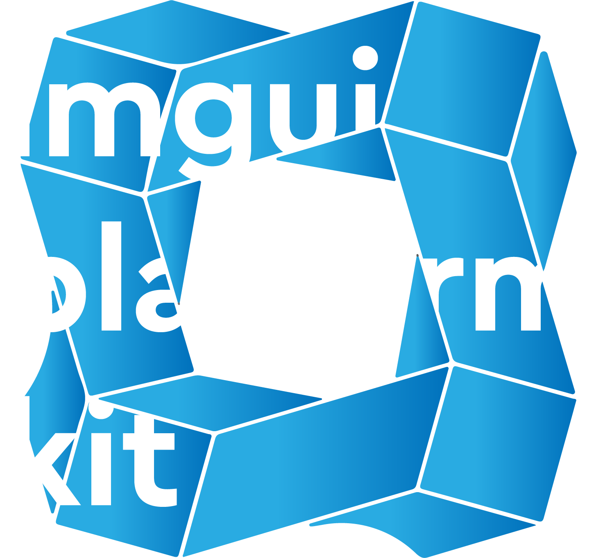

imgui-platform-kit - Cross-platform toolkit for Dear ImGui.
===============================================

[](https://github.com/Jgocunha/imgui-platform-kit/actions/workflows/windows.yml)
[](https://github.com/Jgocunha/imgui-platform-kit/actions/workflows/linux.yml)
[](https://github.com/Jgocunha/imgui-platform-kit/actions/workflows/macos.yml)
[](https://github.com/Jgocunha/imgui-platform-kit/actions/workflows/coverage.yml)
[](https://codecov.io/gh/Jgocunha/imgui-platform-kit)
[](https://github.com/Jgocunha/imgui-platform-kit/wiki)


## Description
**ImGui Platform Kit** is a cross-platform toolkit designed to facilitate the development of user interfaces using **Dear ImGui**, **ImPlot**, and **imgui-node-editor** integrated with DirectX 12 for Windows, or integrated with GLFW and OpenGL3 for Linux and macOS. This toolkit provides a comprehensive set of tools for creating customizable graphical interfaces, logging windows, and interactive plots, making it suitable for applications that require dynamic and visually appealing UI elements.

## Common dependencies
- **C++20**: Compatible with modern C++ standards for optimal performance and functionality.
- **CMake 3.15 or higher**: For building and managing the project configurations.
- **VCPKG**: To manage C++ libraries on Windows, ensuring easy integration of ImGui and ImPlot.
- **Dear ImGui**: Used for the base GUI components (installed automatically by the build scripts).
- **ImPlot**: Provides plotting capabilities within ImGui interfaces (installed automatically by the build scripts).
- **imgui-node-editor**: Provides the capability of creating node-based graphs (installed automatically by the build scripts).
- **STB Image**: For image loading and texture handling (already included in project).

## Windows specific dependencies
- **DirectX 12**: Required for rendering on Windows platforms.

## Linux specific dependencies
- **OpenGL**: API for rendering 2D and 3D vector graphics.
- **GLFW**: Multi-platform library for OpenGL development on the desktop.

## macOS specific dependencies
- **OpenGL**: API for rendering 2D and 3D vector graphics. Note: OpenGL is deprecated on macOS since 10.14 but remains functional through current macOS releases.
- **GLFW**: Multi-platform library for OpenGL development on the desktop.
- **Xcode Command Line Tools**: Required for compilation (`xcode-select --install`).

## Functionalities
- **Dynamic Window Management**: Create and manipulate multiple window types with various properties.
- **Enhanced Logging**: Dedicated logging window with support for multiple log levels and colored text output.
- **Font and Style Customization**: Load and manage fonts and UI styles.
- **Background Image Handling**: Support for scalable background images in UI windows.
- **Screen Resolution Flexibility**: Automatically adjusts to the primary monitor's resolution if specific dimensions are not provided.
- **Plotting Integration**: Leverage ImPlot for integrated plotting capabilities within the ImGui interface.
- **Node-based Graph Editing**: Implement node-based graphs using the imgui-node-editor library.

## Getting started

1. Clone this repository to your local machine using Git.
2. Run the appropriate build script for your platform. Make sure you have VCPKG installed and the `VCPKG_ROOT` environment variable defined.
3. Run the example executable to see the toolkit in action.

## Build and installing

Included in the project are platform-specific build and install scripts to simplify the process:

| Platform | Build | Install |
|---|---|---|
| Windows | `build.bat` | `install.bat` |
| Linux | `build.sh` | `install.sh` |
| macOS | `build_macos.sh` | — |

- **Build scripts**: Compile the project and install vcpkg dependencies automatically.
- **Install scripts**: Install the built library to a specified location using CMake.

**Linux note:**
You might have to:
1. Create a build directory inside the project folder: `mkdir build`
2. Set `VCPKG_ROOT` as an environment variable: `export VCPKG_ROOT=/opt/vcpkg` (see *Installing vcpkg* below).

Before running `build.sh`.

**macOS note:**
The `build_macos.sh` script auto-detects your architecture and selects the correct vcpkg triplet (`arm64-osx` for Apple Silicon, `x64-osx` for Intel). Ensure `VCPKG_ROOT` is set before running:
```bash
export VCPKG_ROOT="$HOME/vcpkg"
./build_macos.sh
```

### Integration with Your Project
After running the ```install.bat```, ```install.sh``` script, the ImGui Platform Kit will be installed on your system. You can then integrate it with your own projects by modifying your CMake configuration to link against the installed ImGui Platform Kit library.

Here's an example snippet for a typical CMakeLists.txt that uses ImGui Platform Kit:

```cmake
cmake_minimum_required(VERSION 3.15)
project(MyAwesomeApp)

# Find the ImGui Platform Kit package
find_package(imgui-platform-kit REQUIRED)

# Define your application's executable
add_executable(MyAwesomeApp main.cpp)

# Link against the ImGui Platform Kit
target_link_libraries(MyAwesomeApp PRIVATE imgui-platform-kit)
```

### How to Create a New Window

1. **Define Your Window Class**:
 ```cpp
 #include "base_window.h"

 class MyCustomWindow : public BaseWindow 
 {
 public:
     MyCustomWindow();
     void render() override;
 };
 ```
2. **Implement Your Window Class**
```cpp
MyCustomWindow::MyCustomWindow() 
{
    // Initialization code here
}

void MyCustomWindow::render() 
{
    if (ImGui::Begin("Custom Window")) 
        ImGui::Text("Hello, World!");
    ImGui::End();
}
 ```
3. **Instantiate and Use Your Window:**
Add your window to the UserInterface instance:
```cpp
UserInterface ui;
ui.addWindow<MyCustomWindow>();
```
This approach allows for easy extension and integration of new custom windows into the existing UI framework provided by ImGui Kit.

## Dependencies that aren't installed automatically

### Installing CMake

**Linux (Ubuntu/Debian):**
```bash
sudo apt update
sudo apt install cmake build-essential
```

**macOS:**
```bash
brew install cmake
```

### Installing vcpkg

**Linux (Ubuntu/Debian):**

```bash
sudo apt update
sudo apt install -y zip unzip build-essential pkg-config
wget -qO vcpkg.tar.gz https://github.com/microsoft/vcpkg/archive/master.tar.gz

sudo mkdir /opt/vcpkg
sudo tar xf vcpkg.tar.gz --strip-components=1 -C /opt/vcpkg

sudo /opt/vcpkg/bootstrap-vcpkg.sh
sudo ln -s /opt/vcpkg/vcpkg /usr/local/bin/vcpkg

vcpkg version
```

**macOS:**
```bash
git clone https://github.com/microsoft/vcpkg.git "$HOME/vcpkg"
"$HOME/vcpkg/bootstrap-vcpkg.sh" -disableMetrics
```

Add `VCPKG_ROOT` to your environment variables.

To set it for the current shell session:
```bash
export VCPKG_ROOT="/opt/vcpkg"      # Linux
export VCPKG_ROOT="$HOME/vcpkg"     # macOS
```
To set it permanently, add the export line to your `~/.bashrc` (Linux) or `~/.zshrc` (macOS) and run `source ~/.bashrc` / `source ~/.zshrc`.

### Installing OpenGL

**Linux:**

OpenGL should be installed by default if you have your graphics drivers installed. To verify:
```bash
sudo apt-get install mesa-utils
glxinfo | grep "OpenGL version"
```

**macOS:**

OpenGL is included with macOS (no installation required). Note: Apple deprecated OpenGL in macOS 10.14 but it remains fully functional on current releases.

### Installing GLFW

GLFW is installed automatically by the build scripts via vcpkg. If you need it separately:

**Linux:**
```bash
sudo apt-get install libglfw3 libglfw3-dev
```

**macOS:**
```bash
brew install glfw
```

### Using g++ 13 on Ubuntu 22.04 for std::ranges support

```bash
sudo add-apt-repository -y ppa:ubuntu-toolchain-r/test
sudo apt install -y g++-13
g++-13 --version # verify
```
